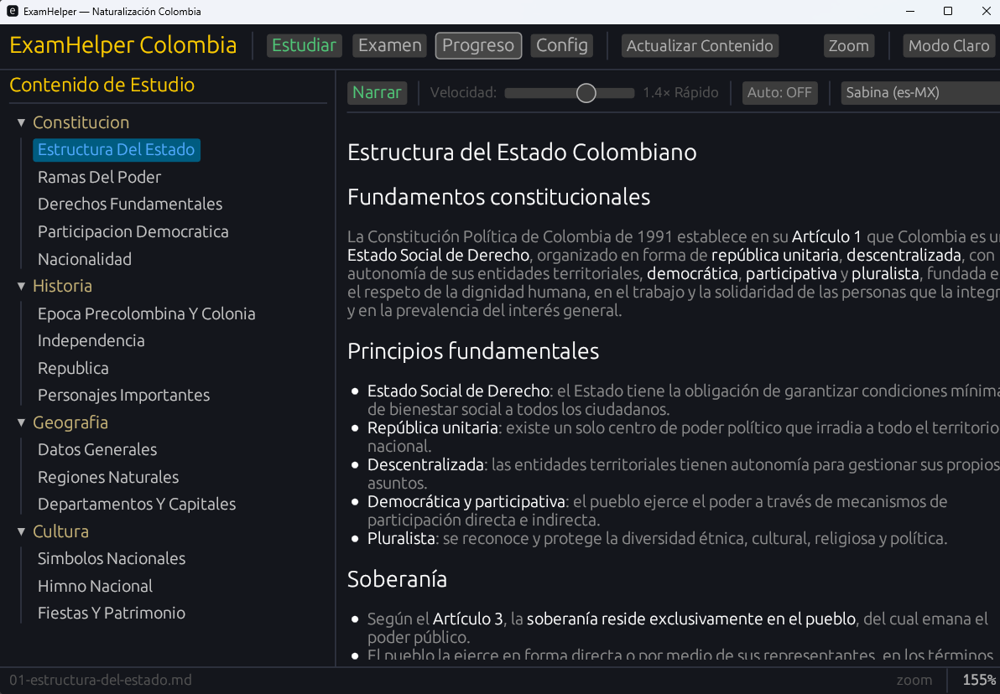

# ExamHelper — Learning Console



Desktop learning console for Windows with cartridge-based study modules, multilingual TTS narration, and exam practice. Built in Rust with egui.

---

## Features

### Cartridge System
- Pluggable study modules — each cartridge ships its own content, questions, fonts, and language config
- Bundled cartridges: **Colombian Nationality** (Spanish) and **Japanese 100** (Japanese/English)
- Drop a new cartridge folder into `cartridges/` and restart — no recompile needed

### Study Mode
- Markdown-rendered content with sidebar navigation
- Multilingual language blocks with bespoke visual styling
- Progress tracking — mark each section as read

### TTS Narration
- Windows SAPI/WinRT voices with automatic language switching per content block
- Playback modes (cycle with one button):
  - **Manual** — narrate on click
  - **Auto** — narrate on section select
  - **Loop** — repeat current section
  - **Next** — advance to next section automatically
- Speed control: 0.25x to 2.0x
- Per-cartridge voice mapping with fallback detection

### Exam Mode
- Multiple-choice questions with fixed and dynamic (template) variants
- Category selection and configurable question count
- Score breakdown with pass/fail per category

### Self-Update
- Checks GitHub releases on startup for newer MSI installers
- Version label in status bar — click to manually check for updates
- One-click download and install (elevated MSI via PowerShell)

---

## Install

Download the latest `.msi` from [GitHub Releases](https://github.com/ophiocus/examhelper/releases) and run it. The installer places the app in Program Files with a desktop shortcut.

## Build from Source

```bash
cargo build --release
```

Binary: `target\release\examhelper.exe`

### Build MSI Installer

```bash
cargo install cargo-wix
cargo wix
```

MSI: `target\wix\examhelper-*.msi`

---

## Project Structure

```
examhelper/
├── src/
│   ├── main.rs
│   ├── app.rs                 # Core app state and eframe impl
│   ├── cartridge/             # Cartridge system (manifest, filesystem, registry)
│   ├── tts/                   # TTS engine (worker thread, strip/parse, language ranges)
│   ├── ui/                    # UI modules (study, exam, settings, top bar, git update)
│   ├── config.rs              # User config persistence
│   ├── progress.rs            # Study progress tracking
│   └── theme.rs               # Dark/light theme
├── cartridges/
│   ├── colombian-nationality/ # Spanish nationality exam prep
│   │   ├── manifest.toml
│   │   ├── content/           # Markdown study material
│   │   └── questions/         # TOML question banks
│   └── japanese-100/          # Japanese language basics
│       ├── manifest.toml
│       ├── fonts/             # Bundled NotoSansJP font
│       ├── content/           # Markdown with {{lang:ja}}...{{/lang}} blocks
│       └── questions/         # TOML question banks
├── wix/                       # WiX MSI installer config
├── assets/                    # Icon, screenshot
├── .github/workflows/         # CI/CD
└── Cargo.toml
```

## Creating a Cartridge

A cartridge is a folder in `cartridges/` with a `manifest.toml`:

```toml
id = "my-cartridge"
name = "My Cartridge"
description = "Description here"
accent_color = [80, 200, 120]

[[languages]]
code = "en"
tts_preference = ["en-US", "en-GB", "en"]
```

Add content as Markdown files in `content/` subdirectories, and questions as TOML files in `questions/`.

For multilingual content, wrap non-default language text in range blocks:

```markdown
This is English text (default language).

{{lang:ja}}
これは日本語です
{{/lang}}

Back to English.
```

---

## Release Process

Releases are automated via GitHub Actions. To publish a new version:

1. Bump the version in `Cargo.toml`
2. Commit the change
3. Tag and push:
   ```bash
   git tag v0.X.Y
   git push && git push origin v0.X.Y
   ```
4. The [release workflow](.github/workflows/release.yml) automatically:
   - Builds the release binary on `windows-latest`
   - Installs WiX 3.11 and runs `cargo wix` to produce the MSI
   - Creates a GitHub Release with the `.exe` and `.msi` attached
   - Generates release notes from commit history
5. Installed clients detect the new release on next startup and offer one-click update

---

## Requirements

- Windows 10/11
- TTS voice packs for your cartridge's languages (installable from Settings)

## License

MIT

## Author

ophiocus
